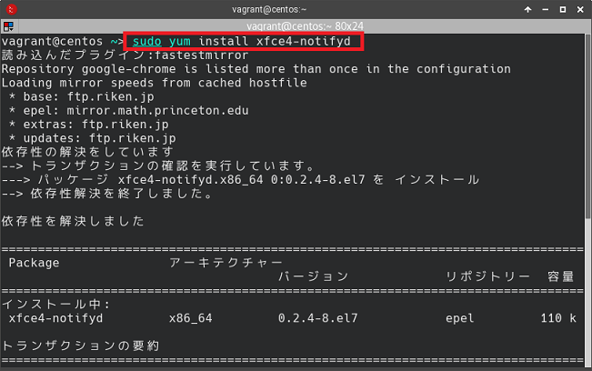
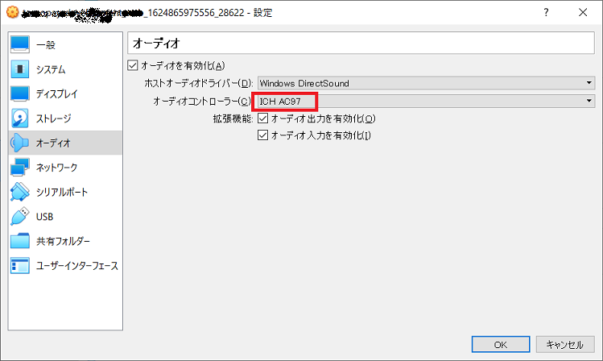
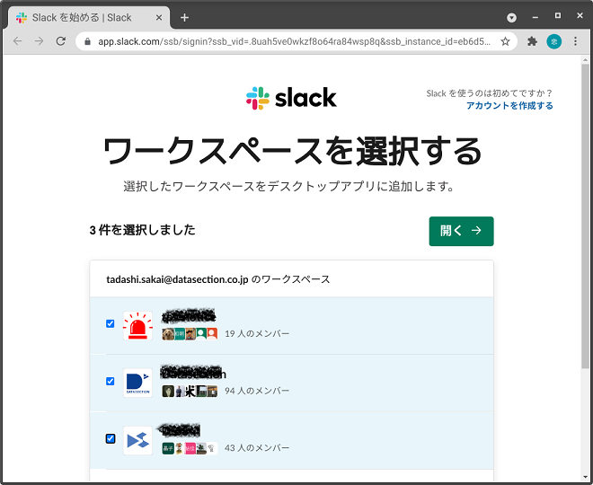
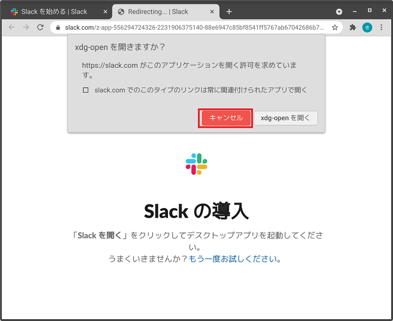
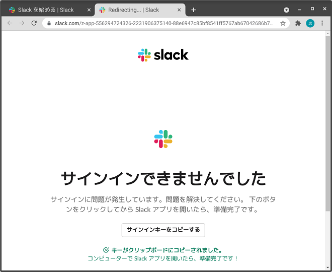

This Manual is used for Windows user to build a CentOS7+Xfce VM for delelopment usage & Office work.

# Prerequisites

I assume I am using windows with VirtualBox pre-installed.

Recommended Vagrant Setting will be:

	vm.memory = 4096
	server.vm.box = "goraje/centos7-xfce"


## Preparations

Bring up the virtual box with command

	vagrant up

## Here we go

 1. Set system language Enviorment to [Japanese](https://www.server-world.info/query?os=CentOS_7&p=japanese)
  
 2. Install japanese input method, and set $HOME/.xinitrc & $HOME/.bashrc [link](https://qiita.com/msakamoto_sf/items/bf2e37b22ae6694440c3#ibus-kkc-%E3%81%AE%E3%82%A4%E3%83%B3%E3%82%B9%E3%83%88%E3%83%BC%E3%83%AB)

```~/.xinitrc
export GTK_IM_MODULE=ibus
export XMODIFIERS=@im=ibus
export QT_IM_MODULE=ibus
ibus-daemon -drx
exec /usr/bin/xfce4-session
```
 
 3. start up ibus-setup in application finder, and set shortcut key & keyboard layout
 
 
 
 
  
 

 4. [Stop](https://qiita.com/kenjjiijjii/items/1057af2dddc34022b09e#%E3%82%B5%E3%83%BC%E3%83%93%E3%82%B9%E3%81%AE%E8%B5%B7%E5%8B%95%E5%81%9C%E6%AD%A2) Firewall.

 5. install xfce-notifyd
 
```
 	sudo yum install xfce-notifyd
```
 

 6. Set audio in vm setting
 
 
 
 after restart vm, set pulse audio Volumn
 
 
 
 7.  install xfce-screenshooter

```
 	sudo yum install xfce-screenshooter
```
 
 
 change short cut key of `xfce-screenshooter` to Shift+Print
 
 
 
 8. [Install](https://phoenixnap.com/kb/install-java-on-centos#ftoc-heading-5) Oracle Java.
 

## Option

Install Evolution ↓

```
sudo yum update
sudo yum install evolution
sudo yum install evolution-ews
```

Install [Google](https://qiita.com/shadowhat/items/af6b973df43d75abfe8e)

Install [Slack](https://slack.com/intl/ja-jp/help/articles/212924728-Linux-%E7%89%88-Slack--%E3%83%99%E3%83%BC%E3%82%BF%E7%89%88--%E3%82%92%E3%83%80%E3%82%A6%E3%83%B3%E3%83%AD%E3%83%BC%E3%83%89%E3%81%99%E3%82%8B#fedora-1)

If [xdg-open] failed, do the following










## Referred to
[Install](https://www.atmarkit.co.jp/ait/articles/1609/13/news024.html) with rpm file

[Enable SSH Server on Debian](https://linuxhint.com/enable-ssh-server-debian/)

