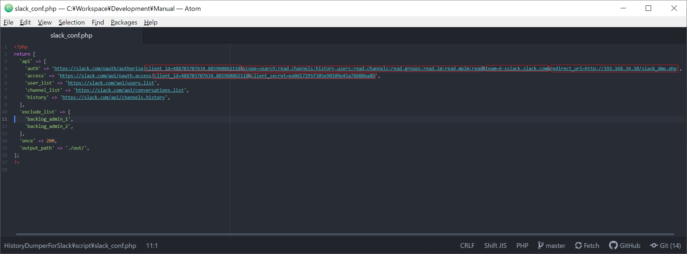

# Prerequisites

A PHP script is prepared for dumpping out chat history of slack into a excel form. And a slack api is supposed to be called with a token , which is returned from a slack api.
So a preparation of making a slack application is needed, as well as installing all modules needed for PHP to be able to manipulate a excel document.

> 1.  [Full text engine](../FullTextSearchEngine) is set and be ready to use.

> 2. Update to PHP 7.3 by running commands below (root user).

* apt install php7.3
* a2dismod php7.0
* systemctl restart apache2
* a2dismod php7.3
* systemctl restart apache2

> 3. install prerequisites for composer (root user)

apt install curl php-cli php-mbstring php-xml php-gd git unzip

> 4. Follow [instructions](https://www.digitalocean.com/community/tutorials/how-to-install-and-use-composer-on-debian-9#step-2-%E2%80%94-downloading-and-installing-composer) to install composer (root user)

> 5. Install [phpoffice-phpspreadsheet](https://phpspreadsheet.readthedocs.io/en/latest/#installation) with following instruction.

* composer require phpoffice/phpspreadsheet

> 6. Make a slack app (name example : collector) and install it into subject workspace from where history will be pulled out.

> 7. Keep the client id and client secret, which is used for authentication.

> 8. Keep the redirection and don't forget to set scope, which is used for getting a access token.

## Preparations

> 1. Edit config file for dumper script, with the information kept in step 2 and step 3.

> 2. Upload script files into /var/www/html. And set the file permission to 777.

## Start to Execute
 1. Open browser and navigate to http://192.168.34.10/slack_dmp.php, a confirm page will show as follow.
 

 2. Press [許可する]
 
 3. Check excel product under /var/www/html. Text files are outputed under /var/www/html/out, which is generated per public channel.
 
 

## Referred to
Show [Unknown PHP Error ](https://teratail.com/questions/144529#reply-218184) 

About PHP Spreadsheet [dependency](https://github.com/PHPOffice/PhpSpreadsheet/issues/1189)
